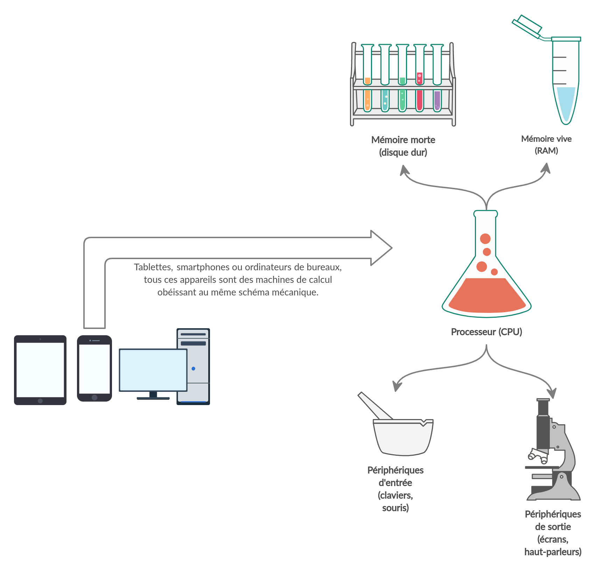

# Module 01 - Introduction et bases de la programmation

## 01. Intro

### Introduction

Jusqu'à maintenant, vous n'avez pas vraiment programmé. Vous avez tapé des lignes et des lignes de HTML et de CSS, mais ce sont des langages de description. Ils cadrent sémantiquement la donnée, la mettent en forme, disent au navigateur « ceci est un titre, et les titres sont bleus. »

Vous parlez poliment avec la machine, vous lui donnez des informations utiles qui lui permettent d'offrir à l'utilisateur une expérience agréable, mais vous n'en êtes pas encore à lui donner des ordres.

L'heure est donc enfin venue de mettre Terminator au pas. Assis ! Couché ! Quand je siffle, tu donnes la patte ! Quand je claque des doigts, tu roules trois fois sur le dos !

Vous allez, au cours de cette formation, apprendre le javascript et le PHP. Ce sont tous les deux des langages de programmation impératifs, et leur principe est donc de donner des ordres à la machine. Ou plus précisément : des instructions. La programmation impérative n'est pas la seule façon de développer, il existe en effet d'autres paradigmes comme la programmation fonctionnelle. Mais la programmation impérative est de très loin la façon de travailler la plus connue, la plus utilisée, sans doute aussi l'une des plus simples à aborder, et c'est celle-ci que nous allons apprendre.

Ce que vous apprendrez dans un langage impératif vous sera utile dans tous les langages impératifs. Une instruction en javascript fonctionne selon le même principe qu'en PHP, seule la syntaxe sera amenée à changer, comme entre des langues humaines. Que vous disiez « Assis ! » ou « Sit down! » à votre chien, le langage utilisé est différent mais le résultat est le même : vous avez donné une instruction et la brave bête a immédiatement posé ses fesses sans attendre un merci.

### Qu'est-ce qu'un ordinateur ?

Un ordinateur, fondamentalement, c'est de la mémoire vive, de la mémoire morte, et un processeur. Ajoutons à cela un écran pour que la machine puisse communiquer avec nous, puis un clavier pour que nous puissions communiquer avec la machine.

* La mémoire vive, c'est la mémoire à court terme de votre ordinateur. C'est l'équivalent de votre propre mémoire à court terme, et elle joue le même rôle. C'est une mémoire d'utilité immédiate. Si je dis « Passe-moi le sel » à Magali, entre le moment de l'instruction et le moment où je reçois effectivement le sel, j'ai besoin que la personne se souvienne de ce que je viens de lui demander. Pendant ces cinq secondes elle ne doit pas changer d'avis pour le poivre, oublier que je lui ai parlé ou même quitter la table pour danser le tango avec le chat. Ce sont cinq secondes de sa vie où elle sait qu'elle doit me passer le sel, et elle va le faire. Pour autant, si je lui demande dans dix ans « Tu te souviens de ce 13 juillet 2020 quand je t'ai demandé le sel ? », il y a de fortes chances qu'elle n'en ait aucun souvenir. Notre cerveau stocke en permanence des informations « jetables » qui nous servent à fonctionner au quotidien, dans nos moindres gestes et discussions. C'est la mémoire à court terme, ou ce qu'on appelle la mémoire vive dans un ordinateur. Elle est physiquement stockée dans les barrettes de RAM, et vous la manipulerez virtuellement à travers des « variables ». Nous y reviendrons.

* La mémoire morte, à l'inverse de la mémoire vive, est l'équivalent de la mémoire à long terme de votre cerveau. Si je vous demande les dates de la Seconde Guerre Mondiale, le prénom de votre mère ou la couleur d'une feuille de chêne, vous saurez me répondre parce que votre cerveau a stocké ces informations il y a longtemps et elles restent relativement accessibles. Dans l'ordinateur, elle est physiquement stockée sur le disque dur, et vous la manipulerez virtuellement sous de nombreuses formes, dont notamment les « fichiers » que vous connaissez déjà.

* Le processeur, c'est l'équivalent des parties de votre cerveau qui traitent l'information. Si je vous dis « 2 * 6 », vous me répondez « 12 ». Quand vous jouez aux sept différences, vous allez analyser intensément les deux photographies et faire encore une fois travailler vos muscles cérébraux. Le processeur, dans l'ordinateur, c'est également cette partie centrale dédiée au traitement et au calcul, sans laquelle rien ne fonctionnerait. J'entre « 2 * 6 » au clavier sur le logiciel de calculatrice, « 12 » s'affiche dans le petit écran. C'est le processeur qui organise tout ce qui se passe sur l'ordinateur, et c'est au processeur que nous, développeurs, donnons des ordres.

* Enfin, nous avons les périphériques d'entrée qui permettent à l'humain de parler à la machine, et les périphériques de sortie qui permettent à la machine de parler à l'humain.



### Qu'est-ce qu'un processeur ?

Sans entrer dans les détails (ce serait très technique et inutile ici), un processeur est une petite créature métallique composée de puces, qui communique avec le reste des composants de l'ordinateur selon le seul langage qu'elle comprend : des séries d'impulsions électriques cadencées de manière très précise. Vous connaissez le code Morse ? Deux longs bips pour la lettre « M », un long et quatre courts pour le chiffre « 6 », etc. La langue du processeur, c'est... à peu près ça. Un code infiniment plus complexe, certes, mais également basé sur des séries précises de bips et de silences. Ou plus exactement : des séries de « une impulsion électrique » et de « pas d'impulsion électrique », respectivement représentés par un 1 et un 0. Des 1 et des 0, modélisant des impulsions électriques, c'est la langue de votre processeur. Ça s'appelle – vous le savez sans doute déjà – le binaire. C'est avec des 1 et des 0 que votre ordinateur fait jouer de la musique à vos hauts-parleurs et qu'il fait afficher des photos de chats à votre écran.

C'est la seule langue qu'il comprend, et pour lui donner des instructions, nous allons devoir l'apprendre. À partir de maintenant, le cours sera exclusivement rédigé en binaire.

````
0101001101100001011101100110100101100101011110100010110101110110011011110111010 1011100110010000001110001011101010010011000100011001100000011001100111001001110 1101100101011011100010000001100110011100100110000101101110001001100110001101100 0110110010101100100011010010110110000111011011000010110100101110011001000000110 1100011001010010000001110011011110010110110101100010011011110110110001100101001 0000000100110011011000110000101110001011101010110111100111011001001100110111001 1000100111001101110000001110110010001100100110011011100110001001110011011100000 0111011001001100111001001100001011100010111010101101111001110110010000001101110 0110010100100000011100110010011000100011001100000011001100111001001110110110000 1011100000111000001100101011011000110110001100101001000000111000001100001011100 1100100000011101010110111000100000011001000110100100100110011001010110011101110 0100110000101110110011001010011101101110011011001010010000001101101011000010110 1001011100110010000001110101011011100010000001100011011100100110111101101001011 1001101101001011011000110110001101111011011100010011001101110011000100111001101 1100000011101100111111`
````

Mais non, je plaisante.

Les plus geeks d'entre vous sauront peut-être un jour écrire leur prénom en binaire, mais ça n'ira pas beaucoup plus loin. La vérité est que le binaire est franchement inintelligible pour un être humain, et qu'il nous faut un langage plus intuitif pour pouvoir communiquer efficacement avec nos machines. C'est là qu'interviennent les langages de programmation.

### Qu'est-ce qu'un langage de programmation ?

Quand je dis « Va me faire un café ! » à la pauvre Magali, en vérité son cerveau va lui aussi transformer l'instruction reçue par les oreilles en impulsions électriques avant de la traiter. Une partie du cerveau est dédiée au traitement du langage et à sa conversion en une information électrique que le reste du cerveau peut comprendre. Les langages comme le français ou l'anglais sont cette interface qui nous permet de communiquer entre humains sans avoir besoin de se relier avec des câbles.

L'ordinateur a été créé par l'être humain, et le fruit n'est pas tombé bien loin de l'arbre. Nous communiquons exactement de la même façon avec notre processeur. Nous utilisons un langage de programmation compréhensible par un être humain, et une partie de la machine sera dédiée à la traduction de ces instructions en une information binaire qu'elle peut comprendre.

Le javascript et le PHP, objets de cette formation, sont parmi les langages les plus populaires au monde, et ils sont essentiellement orientés vers les métiers du web. Il en existe bien d'autres : vous avez peut-être un ami statisticien qui fait du python ou du R, un copain bidouilleur qui fait du modding en lua, ou encore une lointaine connaissance dans l'informatique embarquée qui travaille en rust ou en C. Java, C++, C#, perl, il y en a des dizaines. Certains se ressemblent un peu, comme le ruby et le crystal au même titre que le latin et l'italien. D'autres sont très différents, comme le haskell et le go, au même titre que l'allemand et le japonais. Le monde de la programmation est un univers très vaste dans lequel on ne peut pas tout connaître, et où au contraire on se spécialise... dans le web, en ce qui nous concerne. Et le point commun de tous ces langages, quels que soient leurs domaines de prédilection, c'est qu'ils ont absolument tous pour objectif central d'être un pont entre l'alphanumérique de l'humain et le binaire de la machine.