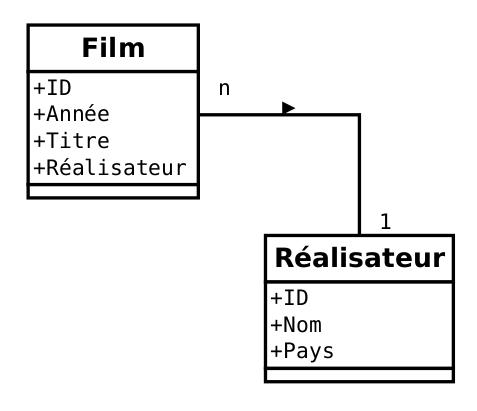

# Module 01 - Différences PHP / JavaScript & Base de données

## 01. Introduction

### Tableau de données

Vous avez tous déjà vu des [tableaux de données](https://en.wikipedia.org/wiki/Table_(information)).

Considérez par exemple cette liste de films :

**Films**

| Année  | Titre  | Réalisateur  |
|---|---|---|
| 1966  | Persona  | Ingmar Bergman  |
| 1997  | La Vie de Jésus  | Bruno Dumont  |
| 2003  | Sarabande  | Ingmar Bergman  |
| 1978  | The Deer Hunter  | Michael Cimino  |
| 1976  | Taxi Driver  | Martin Scorcese  |

C'est un tableau de données. Chaque ligne du tableau, ou `entrée` représente un film ; chaque `colonne` représente une propriété du film. Le film Persona a été réalisé en 1966 par Ingmar Bergman.

&nbsp;

Ajoutons un élément nouveau à ce tableau : un `ID`.

**Films**

| ID  | Année  | Titre  | Réalisateur  |
|---|---|---|---|
| 1  | 1966  | Persona  | Ingmar Bergman  |
| 2  | 1997  | La Vie de Jésus  | Bruno Dumont  |
| 3  | 2003  | Sarabande  | Ingmar Bergman  |
| 4  | 1978  | The Deer Hunter  | Michael Cimino  |
| 5  | 1976  | Taxi Driver  | Martin Scorcese  |

Il s'agit d'un identifiant unique attribué à chaque film ajouté au tableau. L'`ID` s'incrémente à chaque nouvel élément. Ajoutons par exemple un film :

**Films**

| ID  | Année  | Titre  | Réalisateur  |
|---|---|---|---|
| 1  | 1966  | Persona  | Ingmar Bergman  |
| 2  | 1997  | La Vie de Jésus  | Bruno Dumont  |
| 3  | 2003  | Sarabande  | Ingmar Bergman  |
| 4  | 1978  | The Deer Hunter  | Michael Cimino  |
| 5  | 1976  | Taxi Driver  | Martin Scorcese  |

Le dernier film ajouté prend le numéro d'`ID` suivant : de `5`, on passe donc à l'`ID` `6`.

Un tableau de données n'est pas la seule façon de présenter et visualiser des données, mais c'est de loin l'une des plus courantes et intuitives.

### Base de données

Et si on veut ajouter des informations concernant les réalisateurs ? Doit-on les ajouter au même tableau ?

À dire vrai, ce serait une mauvaise idée. Nous avons dit que chaque entrée du tableau représentait un film, et que chaque colonne représentait une propriété dudit film. Ajouter des `colonnes` concernant le réalisateur au tableau des films serait un contresens. Nous avons deux entités distinctes, nous avons donc besoin de deux tableaux :

Réalisateurs
|ID|Nom|Pays|
|---|---|---|
|1|Michael Cimino|USA|
|2|Martin Scorcese|USA|
|3|Akira Kurosawa|Japon|
|4|Ingmar Bergman|Suède|
|5|Bruno Dumont|France|

Films
|ID|Année|Titre|Réalisateur|
|---|---|---|---|
|1|1966|Persona|Ingmar Bergman|
|2|1997|La Vie de Jésus|Bruno Dumont|
|3|2003|Sarabande|Ingmar Bergman|
|4|1978|The Deer Hunter|Michael Cimino|
|5|1976|Taxi Driver|Martin Scorcese|
|6|1950|Rashōmon|Akira Kurosawa|

Nous avons désormais deux tableaux de données, qui constituent une base de données.

### Base de données relationnelle

Notre base de données est encore améliorable. Nous avons deux entités : des films et des réalisateurs. Chaque occurrence d'une entité est identifiée de façon unique et définitive par son ID. Si nous vous demandons le film dont l'`ID` est `5`, vous devez nous donner Taxi Driver.

De là, nous allons pouvoir utiliser les `ID` pour mettre en place des `relations entre les entités`.

**Réalisateurs**

|ID|Nom|Pays|
|---|---|---|
|1|Michael Cimino|USA|
|2|Martin Scorcese|USA|
|3|Akira Kurosawa|Japon|
|4|Ingmar Bergman|Suède|
|5|Bruno Dumont|France|

**Films**

|ID|Année|Titre|Réalisateur|
|---|---|---|---|
|1|1966|Persona|4|
|2|1997|La Vie de Jésus|5|
|3|2003|Sarabande|4|
|4|1978|The Deer Hunter|1|
|5|1976|Taxi Driver|2|
|6|1950|Rashōmon|3|

Nous venons de créer une base de `données relationnelle`. Et la `jointure` entre plusieurs tableaux de données se fait toujours par l'`ID`, jamais par une autre colonne, notamment pour des raisons d'intégrité des données et d'optimisation que nous ne développerons pas ici.

Même si ce n'est pas toujours vrai, partons du principe pour l'instant qu'un film n'a qu'un seul réalisateur. Si on schématise donc rapidement cette base de données, voici à quoi elle ressemble :

Un réalisateur peut avoir plusieurs films, un film n'a qu'un seul réalisateur. C'est ce que l'on appelle une relation `One-to-Many`. Nous y reviendrons.

Vous savez désormais ce qu'est une base de données : un ensemble de tableaux, que nous appellerons désormais `tables`. Chaque `table` est constituée d' `entrées` et de `colonnes`. Ces `tables` peuvent être liées entre elles par des relations.

Rappelons qu'une table est une liste d'occurrences d'une certaine entité : une liste d'articles, une liste de livres, une liste de personnes, ou, dans notre exemple, une liste de films. Et la base de données, c'est le nom que l'on donne à l'ensemble des `tables` d'un même système. Par exemple, la base de données d'un blog très simple pourrait être constituée de trois `tables` : articles, catégories et utilisateurs.
