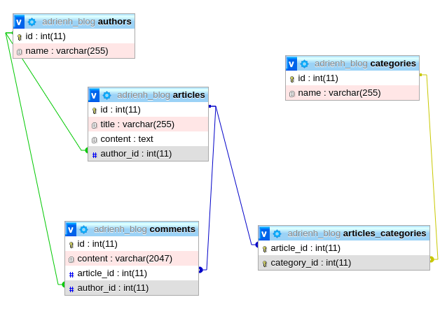

# Module 01 - Différences PHP / JavaScript & Base de données

## 01. Schéma

### Le besoin de schéma

Une base de données, ça peut être complexe. Dans le module précédent nous avons manipulé une base de données de quatre tables, base qui comporte déjà pas mal de relations.

Les projets sur lesquels vous allez travailler, dans un début de carrière classique dans le monde de développement web, auront en général un peu moins d'une dizaine de tables.

Ce nombre peut rapidement grimper. Certains projets sont de vraies usines à gaz et peuvent mobiliser des bases de plusieurs dizaines de tables.

Bref, il est prépondérant d'avoir une visualisation claire de la base de données sur laquelle on travaille. Une liste de tables ne suffit pas, nous avons besoin d'un support visuel : un schéma.

&nbsp;

### Schéma de base de données

Un schéma de base de données est une représentation visuelle, sous la forme de schéma donc, d'une base de données. On pense notre schéma pour illustrer, d'un coup d'œil, l'ensemble des tables, de leurs colonnes et des relations qui les relie.

Considérons un simple blog composé de quatre entités : des articles, des auteurs, des commentaires et des catégories.

- Les auteurs ont un nom, peuvent être liés à un ou plusieurs articles, et peuvent être liés à un ou plusieurs commentaires ;
- Les articles ont un ID, un titre, un contenu, sont nécessairement liés à un auteur, peuvent être liés à un ou plusieurs commentaires, et sont nécessairement liés à au moins une sinon plusieurs catégories ;
- Les commentaires ont un contenu, sont nécessairement liés à un auteur, et sont nécessairement liés à un article.
- Les catégories ont un nom, et peuvent être liées à un ou plusieurs articles.

Détaillons à titre d'exemple certaines des relations mentionnées :

- Les auteurs entretiennent une relation `One-to-Many` avec les articles. Cela signifie qu'un auteur peut avoir plusieurs articles. À l'inverse, les articles n'ont qu'un seul auteur, de leur point de vue c'est une relation `Many-to-One` ;
- La relation entre les articles et les commentaires est de même nature : article peut avoir plusieurs commentaires, un commentaire n'appartient qu'à un seul article. Les relations de type `One-to-Many` – `Many-to-One` sont les plus courantes dans une application.
- Une relation qui peut toutefois retenir notre attention est celle entre les articles et les catégories. En effet, un même article peut appartenir à plusieurs catégories, et une même catégorie peut appartenir à plusieurs articles. Il s'agit ici d'une relation `Many-to-Many`.

Pfiou ! Beaucoup de verbiage, en tout cas, pour décrire une base de données parfaitement simple et basique. Un schéma nous épargne beaucoup de salive et de nœuds au cerveau :



Les relations `One-to-Many` – `Many-to-One` sont représentées par des flèches pointant directement vers les colonnes reliées entre elles. Par exemple, la colonne `author_id` de la table `articles` fait directement référence à la colonne `id` de la table `authors`. Un article écrit par l'utilisateur dont l'`id` est `4` stockera tout bêtement la valeur 4 dans sa propre colonne `author_id`, ainsi le lien sera facile à tracer entre les deux.

Les relations `Many-to-Many` sont un peu plus subtiles, elles exigent par nature une table intermédiaire, ou `table de liaison`. Comme chaque entrée d'une des deux tables peut être liée à plusieurs entrées de l'autre table, il est impossible de stocker les relations directement dans les tables elles-mêmes. Comment ferait-on ? Si l'article `2` est lié aux catégories `12`, `22` et `40`, comment stocker trois valeurs dans une colonne `INT` ? Impossible. Nous avons besoin d'une table intermédiaire pour stocker les relations. Le fait que l'article 2 soit lié aux catégories `12`, `22` et `40` nécessite trois entrées dans la table de liaison `articles_categories` :

#### articles_categories

|article_id|category_id|
|---|---|
|2|12|
|2|22|
|2|40|

Ainsi les relations `Many-to-Many` sont stockées – manuellement – à part dans des tables de liaison. Les requêtes de lecture nécessiteront alors des `JOIN` afin de pouvoir, par exemple, récupérer toutes les catégories d'un article :

````sql
SELECT categories.id, categories.name FROM categories
JOIN articles_categories ON articles_categories.article_id = 2
WHERE categories.id = articles_categories.category_id
````

&nbsp;

### Récapitulons

Vous savez tout.

Le schéma de base de données peut prendre plusieurs formes. En général, la façon la plus simple, et celle qui vous sera demandée désormais au cours de cette formation, est d'illustrer les tables, leurs noms, leurs colonnes liées à leurs types (`int`, `varchar`, etc.), et leurs relations représentées par des flèches. Si des relations` Many-to-Many` exigent des tables de liaison, on les représente aussi.

À partir de maintenant, la création d'un schéma sera préalable à toute création de base de données. Avant de mettre son casque et de foncer dans le tas, on conceptualise. Ça vaut en code, ça vaut encore plus en architecture de données. Ne vous lancez pas dans la création à l'aveugle d'une base de données sans avoir avant tout posé un schéma, fût-il sur papier ou sur n'importe quel autre outil tel que Dia. Vos formateurs insisteront sur ce point et vérifieront la cohérence de vos schémas avant de vous laisser construire vos tables.
