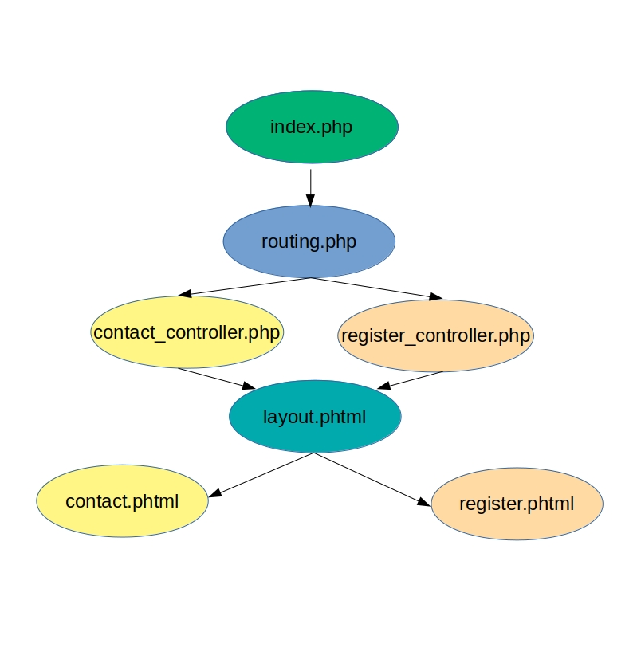

# Module 02 - MVC, Classes et Cookies

## 02. VC

### *VC

Vous rencontrerez de nombreuses interprétations et applications du `MVC`, mais celles-ci se ressembleront toujours dans les grandes lignes.

Mettons pour l'instant le `M` de côté. Concentrons-nous sur l'interaction entre les vues et les contrôlleurs. Nous vous proposons ici un schéma très classique de l'organisation d'un projet web :

Voici une interprétation procédurale – non-POO, donc – du schéma `View` – `Controller`. Considérant que chaque flèche représente un `require` PHP, détaillons le fonctionnement de ce design.

Le fichier `index.php` réceptionne la requête HTTP de l'utilisateur. Absolument toutes nos pages passent toujours, toujours, toujours par l'`index.php`. C'est notre unique point d'entrée. L'`index.php` appelle le `routing` et lui demande de prendre les choses en main.

Le rôle du `routing` est de savoir quelle page ou quelle action l'utilisateur demande en analysant l'URL et ses paramètres. Par exemple, l'URL `index.php?page=register` demanderait la page d'inscription. On utilise donc les paramètres `GET` de la requête HTTP pour déterminer ce que veut l'utilisateur. Un routing fondé sur les paramètres `GET` est très simple à mettre en place.

Une fois que le `routing` a déterminé la page demandée par l'utilisateur, il sait quel `controller` il doit `require`. Et il le fait.

Ainsi, dans notre schéma, si l'utilisateur demande l'URL `index.php?page=register`, le `routing` va `require` le fichier `register_controller.php`.

Notre voyage continue, nous voilà désormais dans le `register_controller.php`. Le rôle d'un `Controller` est de gérer toute la logique liée à une page avant de `require` celle-ci. Il va par exemple définir des variables, qu'il pourra passer ensuite au HTML. Nous y reviendrons.

Que la page requière ou non de la logique ne change pas la finalité du `Controller` : définir quel template HTML il doit générer, et passer celui-ci au `layout.phtml`. Ici, notre `register_controller.php` va par exemple définir une variable `$template = 'register.phtml';`, puis `require` le fichier `layout.phtml`.

Le `layout` représente le squelette de notre HTML. Les parties communes à toutes les pages : balises `<html>`, `<head>`, `<body>`, `<header>` et `<footer>` éventuellement, ne laissant à rendre dynamique que la partie `<main>`. Et c'est dans cette partie `<main>` que nous allons `require` le template précédemment défini : `require 'register.phtml'`;.

Le voyage est terminé, nous avons généré le HTML.

&nbsp;

### En résumé

- L'index.php appelle le routing ;
- Le routing appelle le controller adéquat ;
- Le controller définit le template adéquat et appelle le layout ;
- Le layout appelle le template précédemment défini.
