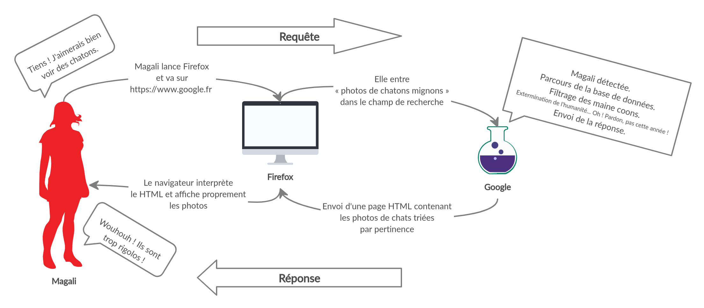

# Module 01 - Différences PHP / JavaScript & Base de données

## 01. Backend

### ***Frontend***

Souvenez-vous de la recherche de Magali.

&nbsp;

Magali envoie une requête HTTP à un serveur : « photos de chatons mignons ». Elle envoie cette requête à un serveur à travers l'Internet. Le serveur réceptionne la requête, la traite, puis génère une page HTML. Il envoie la page HTML au navigateur de Magali, ainsi que tous les fichiers annexes (assets) demandés par ledit HTML : images, polices, CSS, javascript, etc. S'il y a du CSS, le navigateur va l'interpréter pour donner forme au HTML. S'il y a du javascript, le navigateur va l'exécuter pour créer magie et interaction avec Magali.

HTML, CSS, javascript, tous ces fichiers ont été préparés en amont par les développeurs. Le but de ces fichiers est de constituer une réponse à une requête, et d'être compris et affichés par un navigateur. Tout ce travail d'intégration de maquettes et de développement JS relève de ce que l'on appelle le frontend. On développe ce qui va être vu par l'utilisateur, ce qui va interagir directement avec lui à travers son navigateur.

À ce point, nous comprenons désormais ce qu'est le frontend. Mais il reste une part d'obscurité dans notre compréhension du web : le côté serveur. Comment le HTML est-il généré ? Comment, dans notre schéma, le serveur fait-il pour reconnaître Magali ? Pour parcourir une base de données ? Pour filtrer les maine coons ? Toute cette logique est plus ou moins transparente pour l'utilisateur, ce sont les coulisses du web, autrement dit le backend.

&nbsp;

### Backend

Le backend est la partie de notre travail de développeurs qui consiste à mettre en place cette logique de génération de HTML. Les intégrateurs ont préparé des templates, des pages HTML avec des trous ; les développeurs backend vont devoir renvoyer les bonnes pages en fonction de ce que l'utilisateur demande, et remplir ces trous dans les templates avec des données adéquates.

L'utilisatrice a demandé des chatons, mais il faut qu'ils soient mignons. Et c'est Magali, elle n'aime pas les maine coons. Son navigateur est en français, il va falloir privilégier les résultats français...

Toute une logique !

Toute cette logique, toute cette algorithmie, il va falloir l'exprimer de sorte à ce que notre serveur puisse l'exécuter. Ici intervient donc un langage de programmation orienté backend : PHP.

Et si le javascript est plus ou moins le seul langage de programmation compris par les navigateurs et utilisé en frontend, le nombre de langages backend est quant à lui immense. Java, Elixir, Go, Ruby... pour en citer quelques-uns. Et celui qui s'est historiquement imposé comme le langage le plus utilisé dans les backends du web : le PHP.

C'est un langage en constante évolution, avec un écosystème et une communauté gigantesques. Si PHP 5.6 a pu montrer des signes de fatigue sur le marché il y a quelques années face à des concurrents comme Node, sa version 7 sortie fin 2015 lui a fait reprendre du poil de la bête et il est aujourd'hui au sommet de sa forme.

Voyons cela !

